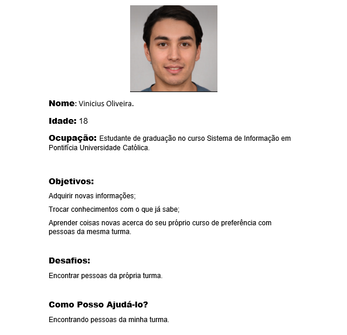
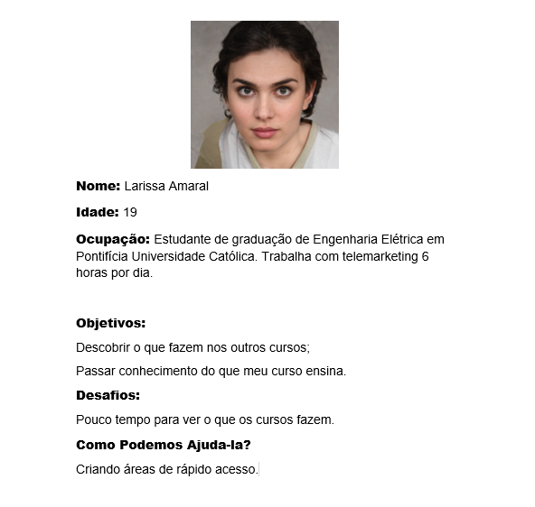

# Informações do Projeto
`TÍTULO DO PROJETO`  

PHILOS DA PUC

`CURSO` 

SISTEMAS DE INFORMAÇÃO

## Participantes

> Darwin Luan Ferreira Gonzaga Tonelli
> 
> Gustavo Coelho Castro Pereira
> 
> Hadassa Brenda Souza Santos
> 
> Naasom Gabriel Abreu Correira Rodrigues
> 
> Victor de Castro Nakabayashi

# Estrutura do Documento

- [Informações do Projeto](#informações-do-projeto)
  - [Participantes](#participantes)
- [Estrutura do Documento](#estrutura-do-documento)
- [Introdução](#introdução)
  - [Problema](#problema)
  - [Objetivos](#objetivos)
  - [Público-Alvo](#público-alvo)
- [Especificações do Projeto](#especificações-do-projeto)
  - [Personas](#personas)
  - [Histórias de Usuários](#histórias-de-usuários)
  - [Requisitos](#requisitos)
- [Projeto da Solução](#projeto-da-solução)
  - [Wireframes](#wireframes)
  - [Mapa de navegação](#mapa-de-navegação)
- [Conclusões](#avaliação-da-aplicação)
  
# Introdução

## Problema

......  COLOQUE AQUI O SEU TEXTO ......

> Nesse momento você deve apresentar o problema que a sua aplicação deve
> resolver. No entanto, não é a hora de comentar sobre a aplicação.
> Descreva também o contexto em que essa aplicação será usada, se
> houver: empresa, tecnologias, etc. Novamente, descreva apenas o que de
> fato existir, pois ainda não é a hora de apresentar requisitos
> detalhados ou projetos. Utilize como base a ficha inicial de detalhamento do problema.
>

## Objetivos

......  COLOQUE AQUI O SEU TEXTO ......

> Aqui você deve descrever os objetivos do trabalho indicando que o
> objetivo geral é desenvolver um software para solucionar o problema
> apresentado acima. Apresente também pelo menos 2 objetivos
> específicos dependendo de onde você vai querer concentrar ou aprofundar
> as características do trabalho.
> 
> **Link Útil**:
> - [Objetivo geral e objetivo específico: como fazer e quais verbos utilizar](https://blog.mettzer.com/diferenca-entre-objetivo-geral-e-objetivo-especifico/)

## Justificativa

......  TEXTO  ......

> Dados do projeto e pesquisa
> Pesquisa para o desenvolvimento

## Público-Alvo

......  COLOQUE AQUI O SEU TEXTO ......

> Descreva quem serão as pessoas que usarão a sua aplicação indicando os
> diferentes perfis. O objetivo aqui não é definir quem serão os
> clientes ou quais serão os papéis dos usuários na aplicação. A ideia
> é, dentro do possível, conhecer um pouco mais sobre o perfil dos
> usuários: conhecimentos prévios, relação com a tecnologia, relações
> hierárquicas, etc.
>
> Adicione informações sobre o público-alvo por meio de uma descrição
> textual, ou diagramas de personas, mapa de stakeholders, ou como o
> grupo achar mais conveniente.
> 
> **Links Úteis**:
> - [Público-alvo: o que é, tipos, como definir seu público e exemplos](https://klickpages.com.br/blog/publico-alvo-o-que-e/)
> - [Qual a diferença entre público-alvo e persona?](https://rockcontent.com/blog/diferenca-publico-alvo-e-persona/)
 
# Especificações do Projeto

 A definição exata do problema e os pontos mais relevantes a serem tratados neste projeto
foi consolidada com a participação dos usuários em um trabalho feito pelos
membros da equipe a partir da observação dos usuários em seu local natural e por meio de
entrevistas. Os detalhes levantados nesse processo foram consolidados na forma de
personas e histórias de usuários.

## Personas

As personas analisadas durante o processo de entendimento do poblema seguem as figuras abaixo:

>**Personas**

>
>
>

 

## Histórias de Usuários

Com base na análise das personas forma identificadas as seguintes histórias de usuários:

|EU COMO...          | QUERO/PRECISO ...                  |PARA ...                                |
|--------------------|------------------------------------|----------------------------------------|
|Eduardo Pereira     | Dividir conhecimento                 | Ajudar pessoas a crescer               |
|Eduardo Pereira     | Adquirir conhecimento de otras áreas| Crescer profissionalmente e aprender novas coisas|
|Eduardo Pereira     | Compartilhar o que as áreas que eu atuo realmente fazem | Pessoas interessadas não terem que perguntar toda hora |
|Eduardo Pereira     | Fazer uma pesquisa sobre um tema especifico | Obejetividade em leituras |
|Vinicuis Oliveira   | Trocar conhecimentos                | Despender tempo com aprendizado |
|Vinicius Oliveira   | Aprender sobre assuntos da minha própria área| Melhorar minhas notas |
|Vinicius Oliveira   | Apresentar minhas duvidas | ter um melhor entendimento |
|vinicius Oliveira   | Vizualizar conhecimentos da área de minha atuação | Gastar menos tempo procurando o que eu quero  |
|Larissa Amaral      | Conhecer o que aprendem em outros cursos | Talvez trocar de curso |
|Larissa Amaral      | Vizualizar um menu do que se faz em tal curso| Ter um melhor conhecimento de cada curso |
|Larissa Amaral      | Abas que agilizam o uso do site | Economizar tempo |
|Larissa Amaral      | quero saber  a fonte das informações | Para verificar a veracidade das informaões |
|Administrador       | Alterar permissões                 | Permitir que possam administrar contas |
|Administrador       | Alterar materias/cursos                | Adicionar ou remover materias/cursos |

## Requisitos

O escopo funcional do projeto é definido por meio dos requisitos funcionais que descrevem
as possibilidades interação dos usuários, bem como os requisitos não funcionais que
descrevem os aspectos que o sistema deverá apresentar de maneira geral, também é apresentado as restrições. Estes requisitos
são apresentados a seguir.

### Requisitos Funcionais
A tabela que segue apresenta os requisitos funcionais do projeto. 

|ID    | Descrição do Requisito  | Prioridade |
|------|-----------------------------------------|----|
|RF-001| Permitir que o usuário se cadastre no seu curso e nas materias que está em sua carga horaria | ALTA | 
|RF-002| O site deve permitir ao usuário visualizar quem gostaria de trocar cohecimento da área desejada | MÉDIA |
|RF-003| O site deve permitir ao usuário visualizar os cursos e materias | ALTA |
|RF-004| O site deve permitir ao usuário vizualizar a fonte para confiablidade da/das informações | ALTA |
|RF-005| O site deve filtro/pesquisa para permitir ao usuário localizar um tema específico que será informado na caixa de pesquisa. | ALTA |
|RF-006| O site deve apresentar na tela de materias/cursos quem está interessado nela | ALTA |
|RF-007| O site deve 
|RF-008| O site deve 
|RF-009| O site deve 
|RF-010| O site deve 
|RF-011| O site deve 
|RF-012| O site deve 
|RF-013| O site deve 
|RF-014| O site deve 
|RF-015| O site deve 

### Requisitos Não Funcionais
A tabela a seguir apresenta os requisitos não funcionais que o projeto deverá atender.

|ID    | Descrição do Requisito  | Prioridade |
|------|-----------------------------------------|----|
|RNF-001| O site deverá ser responsivo permitindo a visualização em celulares de forma adequada | ALTA |
|RNF-002| O site deve ser publicado em um ambiente acessível Publicamente na Internet (Repl.it, GitHub Pages...)| ALTA |
|RNF-003| O site deve ter bom nível de contraste entre os elementos datela em conformidade | MÉDIA |
|RFN-004| O site deve ser compatível com os principais navegadores do mercado (Google Chrome, Firefox, Microsoft Edge) | ALTA |
|RFN-005| O site deve funcionar em tempo real para todos os usuários | ALTA |
|RFN-006| O site deve ser protegido e seguro contra acesso não autorizado | ALTA |
|RFN-007| O site deve ser capaz de lidar com o número necessário de usuários sem qualquer degradação no desempenho.  | ALTA |

### Restrições
As questões que limitam a execução desse projeto e que se configuram como obrigações
claras para o desenvolvimento do projeto em questão são apresentadas na tabela a seguir.

|ID    | Descrição do Requisito  |
|------|-----------------------------------------|
|RE-001| O projeto deverá ser entregue no final do semestre letivo, não podendo extrapolar a data de 07/07/2020.|
|RE-02| O aplicativo deve se restringir às tecnologias básicas da Web no Frontend|
|RE-03| A equipe não pode subcontratar o desenvolvimento do trabalho.|

# Projeto da Solução
  
## Metodologia

Na sua essência, metodologia é um conjunto de métodos, técnicas e processos que visam orientar a realização de uma atividade ou pesquisa. Existem várias metodologias diferentes que são utilizadas em diferentes áreas do conhecimento. Além disso, a metodologia também é importante na vida cotidiana, pois permite que as pessoas organizem suas atividades de forma mais eficiente e produtiva. Uma das principais vantagens da metodologia é que ela permite que as empresas tomem decisões baseadas em dados e informações concretas. Isso é especialmente importante em um mundo cada vez mais competitivo e complexo, onde as empresas precisam ser ágeis e flexíveis para se adaptar às mudanças do mercado e às demandas dos clientes.
               
------------------------------------------------------------------------------
Repositório de código fonte          | GitHub       | https://github.com/rommelcarneiro/tiaw-template

-------------------------------------------------------------------------------
Documentos do projeto                | Google Drive | https://docs.google.com/

------------------------------------------------------------------------------
Projeto de Interface e Wireframes    | MarvelApp    | https://marvelapp.com/4hd6091

------------------------------------------------------------------------------
Gerenciamento do Projeto             | Trello       | https://trello.com/invite/b/aapgz6Ds/ATTId158174551d8dafa255f187369e73050B29B413F/kanban-projeto-philos

------------------------------------------------------------------------------

## Wireframes

......  INCLUA AQUI OS WIREFRAMES DAS TELAS DA APLICAÇÃO COM UM BREVE DESCRITIVO ......

> Wireframes são protótipos das telas da aplicação usados em design de interface para sugerir a
> estrutura de um site web e seu relacionamentos entre suas
> páginas. Um wireframe web é uma ilustração semelhante ao
> layout de elementos fundamentais na interface.
> 
> **Links Úteis**:
> - [Ferramentas de Wireframes](https://rockcontent.com/blog/wireframes/)
> - [Figma](https://www.figma.com/)
> - [Adobe XD](https://www.adobe.com/br/products/xd.html#scroll)
> - [MarvelApp](https://marvelapp.com/developers/documentation/tutorials/)
> 
> **Exemplo**:
> 
> 

## Mapa de navegação

......  COLOQUE AQUI O SEU TEXTO OU DIAGRAMA DE NAVEGAÇÃO .......

> Inclua uma descrição textual ou um diagrama mostrando, sequencialmente, quais ações
> um usuário deve realizar para utilizar todas as características do seu sistema. 

> **Exemplo de Diagrama (opcional, pode ser em texto)**
> 

# Conclusões

......  COLOQUE AQUI O SEU TEXTO ......

> Finalize escrevendo um ou dois parágrafos para relembrar o objetivo do projeto, 
> o que foi possível alcançar e o que ficou para um trabalho futuro, e relembrando
> as principais dificuldes encontradas e como foi possível contorná-las. 

# REFERÊNCIAS

TIAW - EXEMLO DE PROJETO, acessoa em: https://pucminas.instructure.com/courses/138430/files/8159085?module_item_id=3190302

