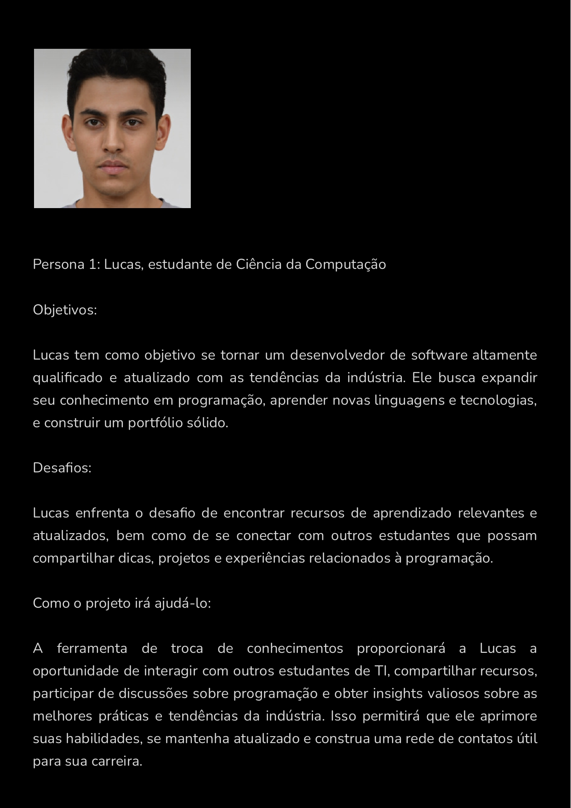
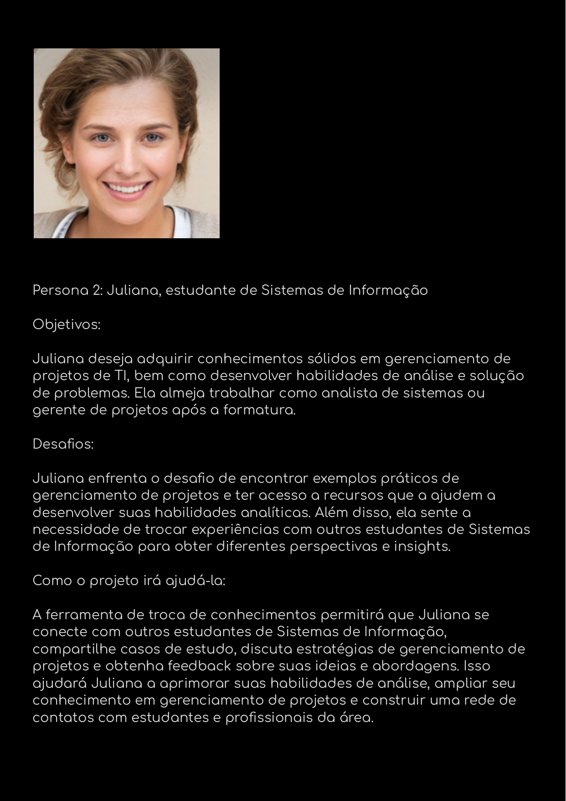
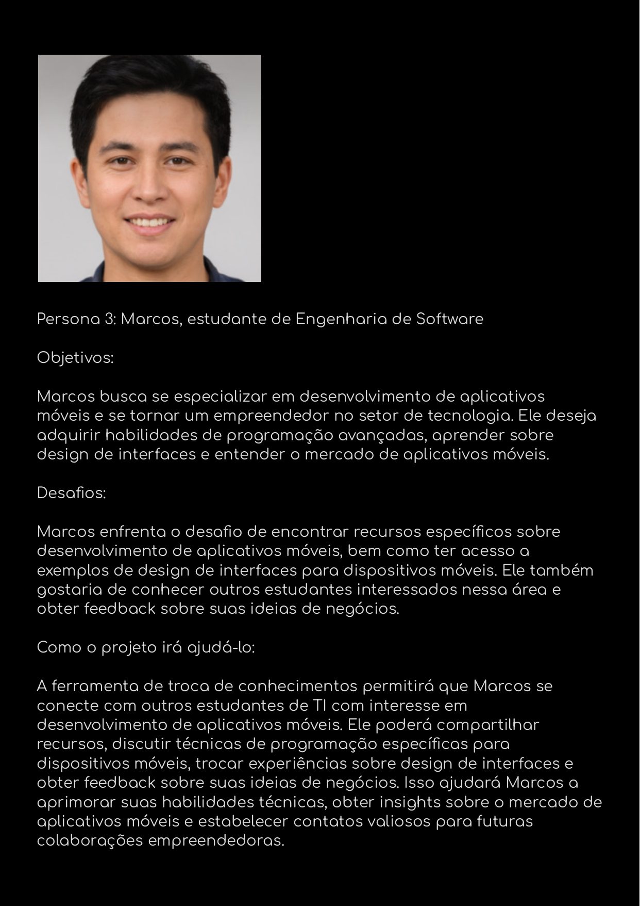
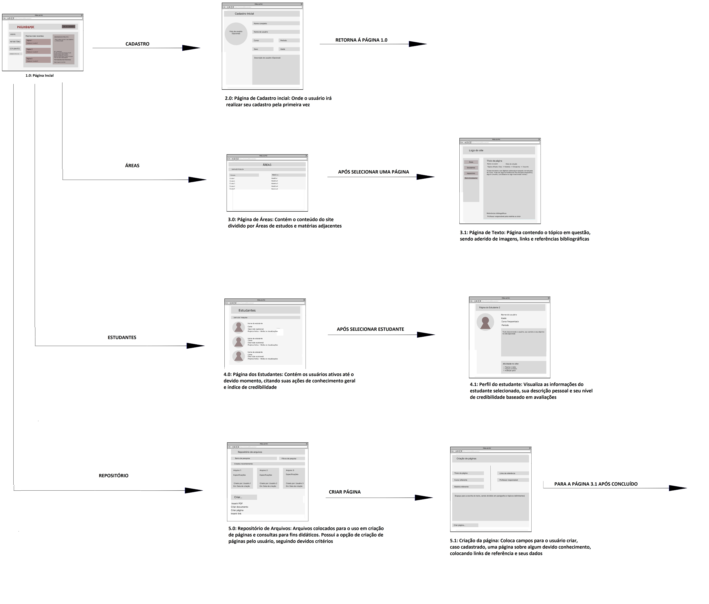

# Informações do Projeto
`TÍTULO DO PROJETO`  

PHILOS DA PUC

`CURSO` 

SISTEMAS DE INFORMAÇÃO

## Participantes

> Darwin Luan Ferreira Gonzaga Tonelli
> 
> Gustavo Coelho Castro Pereira
> 
> Hadassa Brenda Souza Santos
> 
> Naasom Gabriel Abreu Correira Rodrigues
> 
> Victor de Castro Nakabayashi

# Estrutura do Documento

- [Informações do Projeto](#informações-do-projeto)
  - [Participantes](#participantes)
- [Estrutura do Documento](#estrutura-do-documento)
- [Introdução](#introdução)
  - [Problema](#problema)
  - [Objetivos](#objetivos)
  - [Público-Alvo](#público-alvo)
- [Especificações do Projeto](#especificações-do-projeto)
  - [Personas](#personas)
  - [Histórias de Usuários](#histórias-de-usuários)
  - [Requisitos](#requisitos)
- [Projeto da Solução](#projeto-da-solução)
  - [Wireframes](#wireframes)
  - [Mapa de navegação](#mapa-de-navegação)
- [Conclusões](#avaliação-da-aplicação)
  
# Introdução
Há muito tempo é notável o acúmulo de conhecimento que circunda a vida da população. Cada vez mais a informação se torna essencial para tomadas de decisões e para construção de novos conhecimentos. O avanço tecnológico trouxe consigo a revolução da internet e com ela surgiram novas formas de se passar informação e conhecimento, sempre trazendo novidades que facilitam a vida das pessoas. Em um ambiente acadêmico dinâmico como uma faculdade, a troca de conhecimentos desempenha um papel fundamental no crescimento intelectual e na formação dos estudantes. É através dessa interação que ideias são compartilhadas, conceitos são aprimorados e novas perspectivas são adquiridas.

Perante a isso, a pouca interação e colaboração entre os estudantes de diferentes cursos ou semestres, dificulta a troca de conhecimentos dentro da faculdade. Muitas vezes, os alunos ficam restritos aos colegas de suas próprias turmas ou áreas de estudo, perdendo a oportunidade de explorar diferentes perspectivas e conhecimentos complementares.

Diante disso, é muito importante a criação de uma ferramenta que facilite esse processo de troca de conhecimentos, proporcionando benefícios significativos para os estudantes e o ambiente acadêmico como um todo.

## Problema
A falta de interação e colaboração entre os estudantes, traz dificuldades quando necessitam da troca de conhecimentos. O fato de ficarem restritos aos colegas de suas próprias turmas também os prejudicam, perdendo a oportunidade de explorar diferentes perspectivas e conhecimentos complementares. Outro problema, é a dificuldade de acesso a materiais e recursos acadêmicos diversificados. Nem sempre os estudantes têm fácil acesso a uma variedade de materiais didáticos, artigos científicos, livros ou outras fontes de conhecimento relevantes para seus estudos.

## Objetivos
O objetivo geral deste trabalho é auxiliar os estudantes com suas pesquisas e trabalhos acadêmicos. A ideia é a criação de um site que demonstra uma facilidade de manuseamento, trazendo assim, conhecimento de uma forma rápida, havendo um espaço para interações sociais de modo a trazer debates, visando uma troca de conhecimento ampla entre os alunos.

Facilitar a interação e colaboração entre os estudantes: O projeto busca promover a interação entre os estudantes de diferentes cursos, semestres e áreas de estudo, criando um ambiente propício para a troca de conhecimentos, ideias e experiências. Isso contribui para o desenvolvimento de uma cultura de colaboração e aprendizado coletivo.

Promover a criatividade, inovação e pensamento crítico: O projeto tem como objetivo estimular a criatividade e a inovação entre os estudantes, ao expô-los a diferentes perspectivas, abordagens e soluções. Através da troca de conhecimentos, os participantes são encorajados a pensar de maneira mais ampla, desafiadora e crítica, fomentando o desenvolvimento de habilidades essenciais para o mundo acadêmico e profissional.

Facilitar o networking e a formação de parcerias: O projeto busca criar oportunidades para que os estudantes ampliem suas redes de contatos e estabeleçam parcerias com colegas de outros cursos, semestres e até mesmo instituições. Essas conexões podem levar a colaborações futuras, projetos conjuntos e oportunidades profissionais, fortalecendo a formação acadêmica e contribuindo para o desenvolvimento de uma rede de relacionamentos sólida.

Como objetivos específicos, podemos ressaltar:

• Fornecer um espaço de interações, onde os consumidores conseguem debater a respeito de diversos tópicos de determinadas áreas.

• Haveria um local onde teria um filtro de setor, facilitando o acesso ao curso que deseja.

• Os usuários poderiam criar diversos tópicos e subtópicos a respeito de cada matéria ou disciplina que quiserem.

## Justificativa
Conforme o psicólogo canadense Albert Bandura explica na obra Social Learning Theory (1977), “pela observação dos outros, uma pessoa forma uma ideia de como novos comportamentos são executados e, em ocasiões posteriores, essa informação codificada serve como um guia para a ação”.

Na sociedade contemporânea, a internet facilita muito a troca de conhecimento, pois é acessível para a maioria das pessoas. Aprendemos muito visualmente, observando ações e lendo. Além do mais, não somos apenas espectadores, mas também fundadores de um conhecimento que compartilhamos com outros indivíduos. 

Tendo em vista isso, a implementação de uma ferramenta que facilite a troca de conhecimentos dentro da faculdade é justificada pelos benefícios que proporciona aos estudantes, tais como a aprendizagem colaborativa, o acesso a uma rede ampla de conhecimento, a complementação dos conteúdos acadêmicos, o estímulo à criatividade e inovação, além das oportunidades de networking e parcerias. Essa ferramenta contribui para uma formação acadêmica mais enriquecedora, abrangente e alinhada com as demandas do mundo contemporâneo.

## Público-Alvo
Apesar de todos os estudantes poderem utilizar o site, o enfoque seria para os acadêmicos da Pontifícia Universidade Católica de Minas Gerais, mais especificamente os alunos da unidade de São Gabriel, com ênfase nos cursos de Tecnologia da Informação, incluindo alunos de diferentes períodos, abrangendo tanto graduação quanto pós-graduação, tendo em vista, que INICIALMENTE o projeto foi arquitetado visando esse público, vendo a necessidade deles.

Além dos estudantes, o projeto também pode envolver a participação de professores e profissionais da instituição, que podem contribuir com orientações, esclarecimentos e supervisão das atividades.

Desse modo, vemos que o público alvo seriam homens e mulheres, de 17 a 60 anos, casados ou solteiros, que buscam por facilidade na hora de procurar as dúvidas referentes às matérias do curso, visando menos tempo de procura e uma troca variada de conhecimento entre alunos.

# Especificações do Projeto

 A definição exata do problema e os pontos mais relevantes a serem tratados neste projeto
foi consolidada com a participação dos usuários em um trabalho feito pelos
membros da equipe a partir da observação dos usuários em seu local natural e por meio de
entrevistas. Os detalhes levantados nesse processo foram consolidados na forma de
personas e histórias de usuários.

## Personas

As personas analisadas durante o processo de entendimento do poblema seguem as figuras abaixo:

>**Personas**

 

## Histórias de Usuários

Com base na análise das personas forma identificadas as seguintes histórias de usuários:

|EU COMO...          | QUERO/PRECISO ...                  |PARA ...                                |
|--------------------|------------------------------------|----------------------------------------|
|Lucas               | Aprender novas linguagens e tecnologias| Expandir seu conhecimento em programação  |
|Lucas               | Construir um portfóilio sólido| Se tornar um desenvolvedor de software altamente qualificado|
|Juliana             | Desenvolver habilidades de análise e solução de problemas | Trabalhar como analista de sistemas ou gerente de projeto |
|Juliana             | Adquirir conhecimentos sólidos em grenciamento de projetos de TI| Trabalhar como analista de sistemas ou gerente de projeto |
|Marcos              | Adquirir habilidades de programação avançadas | Se especializar em desenolvimento de aplicativos móveis|
|Marcos              | Aprender sobre design de interfaces e entender o mercado de aplicativos móveis| Se tornar um empreendedor no setor de tecnologia |
|Administrador       | Alterar permissões                 | Permitir que possam administrar contas |
|Administrador       | Alterar materias/cursos                | Adicionar ou remover materias/cursos |

## Requisitos

O escopo funcional do projeto é definido por meio dos requisitos funcionais que descrevem
as possibilidades interação dos usuários, bem como os requisitos não funcionais que
descrevem os aspectos que o sistema deverá apresentar de maneira geral, também é apresentado as restrições. Estes requisitos
são apresentados a seguir.

### Requisitos Funcionais
A tabela que segue apresenta os requisitos funcionais do projeto. 

|ID    | Descrição do Requisito  | Prioridade |
|------|-----------------------------------------|----|
|RF-001| O site deve apresentar na página principal as últimas informaçoes da materia/curso marcadas com interesse | ALTA |
|RF-002| O site deve permitir ao usuário cadastrar seu curso e matérias que estuda | ALTA |
|RF-003| O site deve permitir ao usuário visualizar os cursos e matérias e escolher quais tem interesse | ALTA |
|RF-004| O site deve permitir ao usuário vizualizar a fonte para confiablidade da/das informações | ALTA |
|RF-005| O site deve filtro/pesquisa para permitir ao usuário localizar um tema específico que será informado na caixa de pesquisa. | MÉDIA |
|RF-006| O site deve apresentar nas partes de materias/cursos quem está interessado em qual | MÉDIA |
|RF-007| O site deve permiter que professores e coordenadores possam avaliar se as informaçoes trocadas entre usuários é verdadeira | ALTA |
|RF-008| O site deve permitir o usuário poder comentar suas dúvidas | ALTA |
|RF-009| O site deve apresentar apresentar atalhos na tela para vizualizar as informações mais rapidamente | MÉDIA|
|RF-010| O site deve permitir visualizar as informações de contatos do mantenedor do site | MÉDIA |
|RF-011| O site deve permitir o compartilhamento de informações visualizadas em plataformas de redes sociais | BAIXA |
|RF-012| O site deve apresentar um cadastro de turma | ALTA |
|RF-013| O site deve permitir salvar as informações que o usuario desejar | BAIXA |
|RF-014| O site deve permitir verificar as notícias salvas como preferidas | BAIXA |
|RF-015| O site deve o/os administradores alterarem permissões, materias e cursos | ALTA |
|RF-016| O site deve apresentar um tipo de SAC para futuras melhoras do site | MÉDIA |
|RF-017| O site deve permitir professores/coordenadores editar informações divulgada entre os alunos | MÉDIA |
|RF-018| O site deve apresentar uma página de conversas particulares entre todos os tipos de usuários | ALTA |

### Requisitos Não Funcionais
A tabela a seguir apresenta os requisitos não funcionais que o projeto deverá atender.

|ID    | Descrição do Requisito  | Prioridade |
|------|-----------------------------------------|----|
|RNF-001| O site deverá ser responsivo permitindo a visualização em celulares de forma adequada | ALTA |
|RNF-002| O site deve ser publicado em um ambiente acessível Publicamente na Internet (Repl.it, GitHub Pages...)| ALTA |
|RNF-003| O site deve ter bom nível de contraste entre os elementos datela em conformidade | MÉDIA |
|RNF-004| O site deve ser compatível com os principais navegadores do mercado (Google Chrome, Firefox, Microsoft Edge) | ALTA |
|RNF-005| O site deve funcionar em tempo real para todos os usuários | ALTA |
|RNF-006| O site deve ser protegido e seguro contra acesso não autorizado | ALTA |
|RNF-007| O site deve ser capaz de lidar com o número necessário de usuários sem qualquer degradação no desempenho.  | ALTA |

### Restrições
As questões que limitam a execução desse projeto e que se configuram como obrigações
claras para o desenvolvimento do projeto em questão são apresentadas na tabela a seguir.

|ID    | Descrição do Requisito  |
|------|-----------------------------------------|
|RE-001| O projeto deverá ser entregue no final do semestre letivo, não podendo extrapolar a data de 07/07/2020.|
|RE-002| O aplicativo deve se restringir às tecnologias básicas da Web no Frontend|
|RE-003| A equipe não pode subcontratar o desenvolvimento do trabalho.|

# Projeto da Solução
  
## Metodologia

Na sua essência, metodologia é um conjunto de métodos, técnicas e processos que visam orientar a realização de uma atividade ou pesquisa. Existem várias metodologias diferentes que são utilizadas em diferentes áreas do conhecimento. Além disso, a metodologia também é importante na vida cotidiana, pois permite que as pessoas organizem suas atividades de forma mais eficiente e produtiva. Uma das principais vantagens da metodologia é que ela permite que as empresas tomem decisões baseadas em dados e informações concretas. Isso é especialmente importante em um mundo cada vez mais competitivo e complexo, onde as empresas precisam ser ágeis e flexíveis para se adaptar às mudanças do mercado e às demandas dos clientes.
               
------------------------------------------------------------------------------
Repositório de código fonte          | GitHub       | https://github.com/rommelcarneiro/tiaw-template

-------------------------------------------------------------------------------
Documentos do projeto                | Google Drive | https://docs.google.com/

------------------------------------------------------------------------------
Projeto de Interface e Wireframes    | MarvelApp    | https://marvelapp.com/4hd6091

------------------------------------------------------------------------------
Gerenciamento do Projeto             | Trello       | https://trello.com/invite/b/aapgz6Ds/ATTId158174551d8dafa255f187369e73050B29B413F/kanban-projeto-philos

------------------------------------------------------------------------------

## Wireframes
>

**Página Inicial**:
>

Esta página será mostrada assim que o usuário entrar no site, oferecendo acesso às páginas
principais e à um link de cadastro, caso este queira se tornar parte do grupo de editores do site

**Página de Cadastro**
> 

O cadastro possui campos de preenchimento para validar um nome de usuário, Nome verdadeiro,
assim como outras informações como idade, sexo, foto (opcional) e descrição do mesmo

**Página de Estudantes**
> 

Ao entrar nessa página, é possível visualizar e encontrar usuários através da pesquisa
e visulizar seus dados, como nome, idade, sexo, breve descrição e confiabilidade

**Página de Áreas**
> 

Permite a visulização da áreas de estudo, matérias pertinentes e filtros de pesquisa para
que o usuário ache de forma mais fácil o que deseja saber

**Repositório**
> 

Contém os arquivos submetidos ao site pelos usuários para sua consulta ou utilização com base
nos devidos critérios. Possui também a opção de inserir um arquivo, criar uma página, ou criar
seu próprio arquivo em um editor.

 **Criação de Páginas**
> 

Permite a edição e criação de páginas. Tais páginas serão armazenadas no repositório, e sua edição
será possível através do usuário. Na sua criação, o usuário deve referenciar links de consulta e 
informações que validem o que está escrito.

**Página de perfil**
> 

Visualiza o perfil em questão, sendo acessado a partir da página dos estudantes. Possui informações
mais detalhadas a respeito do indivíduo e possivelmente formas de contatá-lo.

**Página de texto**
> 

Seguinte ao link no repositório ou à criação de páginas, ela exibe o texto sobre o determinado assunto
escrito, contendo referências e título. Pode ser acompanhada por imagens e também ser dividida em tópicos
para melhor acessibilidade.

## Mapa de navegação

O diagram apresenta a experiência do usuário começando a partir da página inicial, na qual
ele poderá acessar as páginas dos estudantes, o repositório, a categorização das áreas ou,
se desejar, fazer um cadastro para criar e modificar páginas. As páginas seguem um critério de
autentificação, no qual são necessários fontes, professores vigentes e também que o autor
esteja associado á area que deseja discutir.

# Conclusões

O objetivo principal do projeto é a troca de conhecimento imparcial e confiável, onde os estudantes da Pontifica Universidade Católica de Minas Geral, da unidade de São Gabriel, poderiam se ajudar e aprender uns com os outros. Foi possível alcançar uma parte superficial do projeto considerando que falta ainda colocar as ideias em práticas e fazer os testes.

Ademais, foi difícil encontrar um problema que fosse possível solucionar de uma forma dinâmica, levando em consideração que é um projeto muito recente. Entretanto, depois do entendimento do problema e a forma que seria desenvolvido tornou-se mais fácil 
a execução , não  havendo mais uma dificuldade explicita.
# REFERÊNCIAS

>TIAW - EXEMLO DE PROJETO, acessoa em: https://pucminas.instructure.com/courses/138430/files/8159085?module_item_id=3190302
>
>44% dos brasileiros dizem receber fake news diariamente; veja pesquisa. Disponível em: <https://www.techtudo.com.br/noticias/2022/08/44percent-dos-brasileiros->dizem-receber-fake-news-diariamente-veja-pesquisa.ghtml>.
>
>RODRIGUES, P. G., Cleber. 4 em cada 10 brasileiros afirmam receber fake news diariamente. Disponível em: <https://www.cnnbrasil.com.br/nacional/4-em-cada-10->brasileiros-afirmam-receber-fake-news-diariamente/#:~:text=No%20Brasil%2C%20quatro%20em%20cada>.

